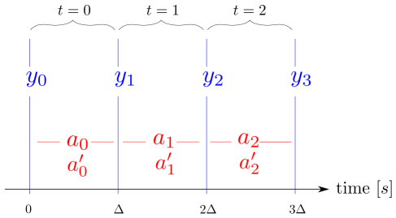

About Time Series
=================

In this section the logic of the _time series_ used for communication between
front and back end and for synchronization between actions and observations is
explained.  For more details, please see our
[paper](https://arxiv.org/abs/2008.03596) on the open-source version of the
TriFinger robot.


On Time Series and Time Relation of Actions and Observations
------------------------------------------------------------


All data transfer between the front end (= user code) and the back end (= robot
hardware) goes through so called time series. When calling
`append_desired_action(action)`, the action is not applied immediately but is
*appended* to the time series of desired actions which serves as a queue.

At each time step, identified by a _time index t_, the backend takes the action
at position _t_ from the "desired actions" time series and sends it to the robot
driver.  At the same time an observation is acquired from the robot and added to
the "observation" time series. This means that the effect of the desired action
`a_t` is not yet visible in the observation `y_t` as is illustrated below.
(`a'_t` corresponds to the *applied action*, see [Desired vs Applied Action]())




`append_desired_action()` returns the time index `t` at which the appended
action will be executed. Methods like `get_observation()` expect a time index as
input.  If the specified time step has already passed, they immediately return
the value from the corresponding step. If it lies in the future, the method will
block and wait until the specified time step is reached and then return.

Note that the buffer size of the time series is limited (see the
`history_length` argument of `SingleProcessRobotData` and
`MultiProcessRobotData`).  If the buffer is full, the oldest element is
discarded.  Trying to access an time index that is not in the buffer anymore
results in an exception.


This design allows for simple code that is automatically executed at the control
rate of the robot:

```{.py}
    # send zero-torque action to get first observation, see explanation below
    zero_torque_action = robot_interfaces.trifinger.Action()
    t = frontend.append_desired_action(zero_torque_action)
    observation = frontend.get_observation(t)

    while True:
        action = smart_algorithm_to_compute_next_action(observation)

        t = frontend.append_desired_action(action)
        # The t given above refers to the moment the given action will be
        # executed.  Right now, this is in the future, so the following call
        # will automatically wait until the action is actually applied to the
        # platform
        observation = frontend.get_observation(t)
```


### Send Action to Start Backend

In the beginning of the program execution, the back end is idle and
waiting for the first action. Only after the first action is received,
the loop is started that applies actions and writes observations to the
time series.

This means **you first have to send an action before you can read the
first observation!**

There are applications where an observation is needed before sending the
first real action (e.g. when the action depends on the current
position).  In this case you need to send a "neutral" action first.  How this
action may look is robot dependent.  The _TriFinger_ robot, for example, can
safely be started with a zero-torque action:


Python:

```{.py}
# an action without arguments defaults to zero torque
zero_torque_action = robot_interfaces.trifinger.Action()
t = frontend.append_desired_action(zero_torque_action)
first_observation = frontend.get_observation(t)
```

C++:

```{.cpp}
Action zero_torque_action = Action::Zero();
auto t = frontend.append_desired_action(zero_torque_action);
auto first_observation = frontend.get_observation(t);
```

Note that the creation of the zero torque action in the above example is
specific to the _TriFinger_ robot.  For other robots, the creation of the action
would need to be adjusted to the action type of that specific robot.  Also, it m


### When Next Action Is Not Provided In Time {#next-action-not-in-time}

If the back end reaches a time step `t` but the user did not yet provide
an action for this time step (e.g. because the user code is running
slower than 1 kHz), the back end automatically sets the desired action
for step `t` to the same as the one of `t - 1`.

This is indicated to the user through the `action_repetitions` field in
the status message which contains the number of times the current action
has been repeated.


